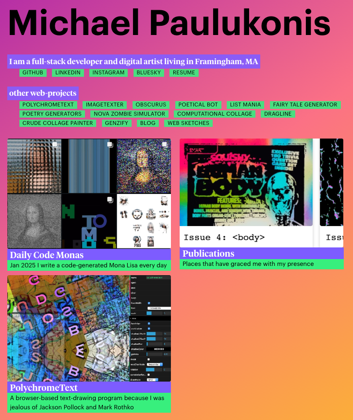

# Personal website blog thingy

I do not feel the need to update as often as I once did.




## TODO:

- ~~convert all extant pages~~
- ~~translate main page~~
- ~~translate styles~~
- ~~new pages~~
- tool that will help me build pages (a CMS oh dear)
- study how Nuxt and Content work
- translate to Content v3

## github pages deployment

- https://nuxt.com/deploy/github-pages

```
If you are not using a custom domain, you need to set NUXT_APP_BASE_URL to your repository-slug for your build step.Example: https://<user>.github.io/<repository>/: NUXT_APP_BASE_URL=/<repository>/ npx nuxt build --preset github_pages
```

https://github.com/actions/deploy-pages#usage


## from nuxt-blog-starter

<https://github.com/GonzaloHirsch/nuxt-blog-starter.git>
<https://gonzalohirsch.com/blog/zero-to-blog-building-with-nuxt-3/>